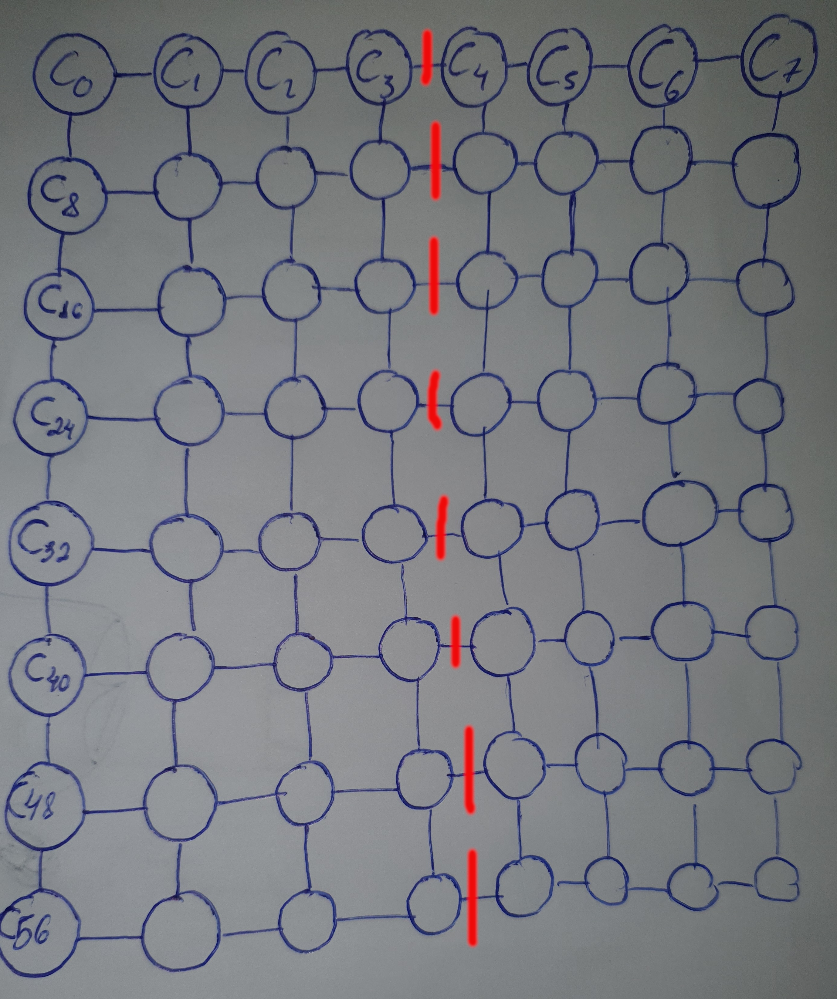

# Ativade 03

> Correção: 1,0

## Questão 01

Temos, então, que a largura de bissecção dessa rede é de 8Mb/s.

## Questão 02
### Caso A
Tempo minímo de 2200 segundos
### Caso B
Tempo minímo de 2000.002 segundos
### Melhor configuração
Para se evitar que uma máquina fique bloqueada aguardadando resposta para continuar a exucução, ambas devem executar num tempo parecido. Então a melhor configuração para a solução de $\Pi$ é $C_2(P_1)$ e $C_1(P_2)$.

## Questão 03
### Speedup máximo
Temos que
$$S(P) = \frac{1}{1-b+\frac{b}{s}}$$
então
$$S(P) = \frac{1}{1-\frac{T_{par}(R)}{T_{par}(P)}+\frac{\frac{T_{par}(R)}{T_{par}(P)}}{s}}$$
como s tende ao infinito é fácil ver que
$$\frac{\frac{T_{par}(R)}{T_{par}(P)}}{s}=0$$
e como sabemos que
$$T_{par}(R) = 90\% \times T_{par}(P)$$
podemos assumir que
$$\frac{T_{par}(R)}{T_{par}(P)}=\frac{0,9}{1}=0,9$$
então
$$S(P) = \frac{1}{1-0,9+0}$$
por fim obtemos
$$S(P)=10$$
### Qual o nome dessa lei?
Chama-se de lei de Amdahl. Em homenagem ao descobridor: Gene Amdahl
