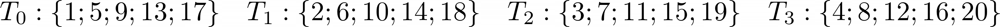
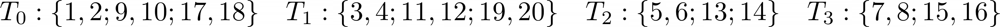
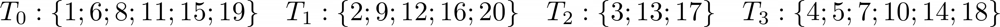
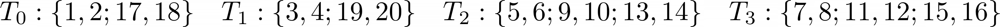
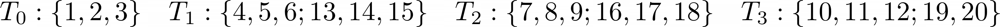

# Atividade 07
---
Supundo para a resulução dos casos abaixo uma máquina com 4 _threads_ e __max__ = 20.

## 1. Determine o número de iterações executada por cada _thread_ se a estrátegia de escalonamento for

As atruibuições de _chunks_ às _threads_ é dinâmico, de modo que, não podemos saber quias _threads_ receberão tais _chunks_ de fato, pode mudar à cada execução do nosso programa. Assim, o que farei aqui é supor um cenário possível.

### static,1
Nesse caso, cada _chunk_ terá uma iteração e cada _thread_ terá uma quantidade aproxímada de _chunks_ para executar.

### static,2

nesse caso, cada _chunk_ terá duas iterações e cada _thead_ terá uma quantidade aproximada de _chunks_.

### static,3

nesse caso, cada _chunk_ terá aproximadamente três iterações e cada _thead_ terá uma quantidade aproximada de _chunks_.

### dynamic,1

Nesse caso, cada _chunk_ terá uma iteração, mas as _threads_ não necessariamente receberão a mesma quantidade de _chunks_, de modo que, cada _thread_ execute num tempo aproximado das outras.

### dynamic,2

Nesse caso, cada _chunk_ terá duas iterações, mas as _threads_ não necessariamente receberão a mesma quantidade de _chunks_, de modo que, cada _thread_ execute num tempo aproximado das outras.

### dynamic,3

Nesse caso, cada _chunk_ terá aproximadamente três iterações, mas as _threads_ não necessariamente receberão a mesma quantidade de _chunks_, de modo que, cada _thread_ execute num tempo aproximado das outras.

